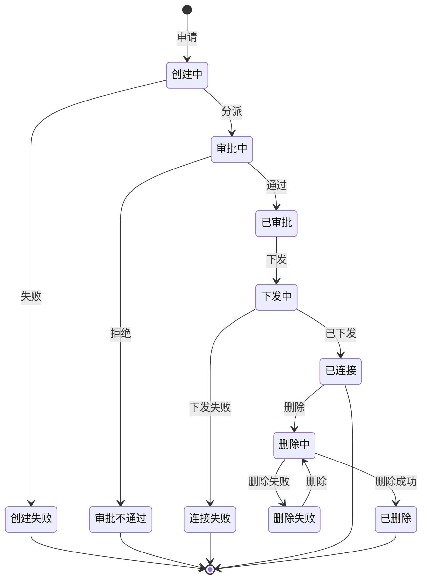

# Spring Statemachine 状态机

状态机：

```mermaid
stateDiagram
[*] --> 创建中 : 申请

创建中 --> 创建失败 : 失败
创建失败 --> [*]

创建中 --> 审批中 : 分派
审批中 --> 审批不通过 : 拒绝
审批不通过 --> [*]

审批中 --> 已审批 : 通过
已审批 --> 下发中 : 下发
下发中 --> 连接失败 : 下发失败
连接失败 --> [*]
下发中 --> 已连接 : 已下发
已连接 --> [*]
已连接 --> 删除中 : 删除
删除中 --> 删除失败 : 删除失败
删除失败 --> 删除中 : 删除
删除中 --> 已删除 : 删除成功
已删除 --> [*]
```

